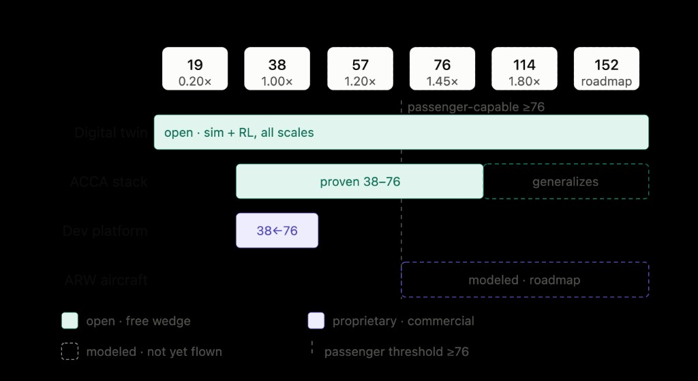
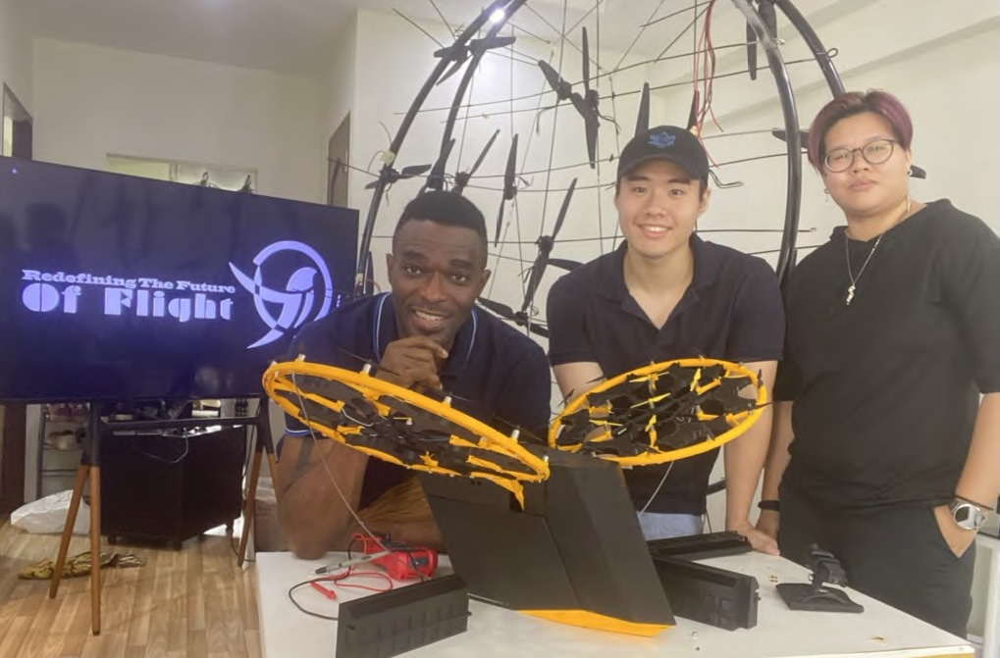

# ARW Articulated Twin — Isaac Sim 6.0 + Newton

**Open-source digital twin** for the AVIUS articulated ring-wing: dozens of small **I.C.2E Snidget** rotors in a closed, canting ring-wing — simulated individually from **19 to 152** rotors, with configuration-dependent control effectiveness **B(q_art)**.

> Replace one big rotor with dozens of small ones, integrated into a closed, articulating ring-wing. That premise hasn't changed. What changed is the fidelity of the twin that represents it.

**Repository:** https://github.com/AVIUS001/arw-articulated-twin

---

## Why we rebuilt on Isaac Sim + Newton

Our first public model lived on **PX4 + Gazebo**. Good for a start — but Gazebo's control path caps at **12 motors**, and it **cannot articulate a wing**. This twin is the Isaac Sim 6.0 + **Newton** sibling: GPU-accelerated, **differentiable** physics (GA at GTC 2026), with a true USD articulation tree (hub → ring → nacelle) and every rotor modeled honestly.

For the first time in our stack, **robotic ring articulation** is in the simulation. When the wing cants, the effectiveness matrix stops being a constant — it becomes **B(q_art)**, a function of articulation state.

---

## The bug we almost shipped

Our flight-control test suite passed every check. Then we audited the build before GitHub and found **B(q_art) conditioning was secretly constant** — a column-normalization bug had erased the exact physics the twin exists to demonstrate. Worse, the test passed anyway, because it asserted a bound the broken matrix trivially satisfied. **A green checkmark on a lie.**

We fixed it before release:

| Check | Before | After |
|-------|--------|-------|
| Condition number vs β (0–25°) | flat at 1.51 | **10.0 → 9.3** (genuine variation) |
| Gradient (analytic vs finite-diff) | not tested | agrees to **~7×10⁻¹⁰** relative error |
| Test assertion | bound only | **requires σ to move** with articulation |

Run the audit yourself:

```bash
python scripts/validate.py      # full suite (9 checks)
python scripts/check_gradients.py  # gradient + articulation guards
```

---

## What ships open vs what stays proprietary

Not everything ships open. **Open the bits, protect the atoms.**



| Layer | Open (teal) | Proprietary (purple) |
|-------|-------------|---------------------|
| **Digital twin** | Sim + RL task, all scales (19→152) | — |
| **Allocator** | Reference pseudo-inverse only | Constrained WQP allocator (off-board) |
| **Control** | — | Proprietary control core, tuned RL / null-space policies |
| **Bridge** | `bridge/ardupilot_bridge_stub.py` (interface only) | Real allocator runs on Jetson / `nox-ecs` |

Passenger-capable configurations start at **≥ 76 rotors** (see ladder). This repo ships geometry and validation for **19 / 38 / 76** today; **57 / 114 / 152** are on the roadmap.

> **Patent-pending:** Articulation control laws and proprietary allocation never enter this repository. See [ISSUES.md](ISSUES.md) for remaining pre-release items (counsel gate, PX4 cross-check).

---

## Rotor configurations

| Rotors | Scale | CAD / vehicle | Status in repo |
|--------|-------|---------------|----------------|
| 19 | 0.20× | `AER8110-1` SET A (2-blade) | USD + validation |
| 38 | 1.00× | `AER8110-2` SET B (3-blade) | USD + validation |
| 57 | 1.20× | — | roadmap |
| 76 | 1.45× | `AER8100-1` quad ring-wing | B-matrix scaling |
| 114 | 1.80× | — | roadmap |
| 152 | — | full DEP envelope | roadmap |

Propulsion: **AV5008TM-HV** @ 74 V, τ_e = 7.0 ms, k_T from Rev D bench cluster (not Maxon EC 69).

---

## Quick start (< 45 min)

```bash
git clone https://github.com/AVIUS001/arw-articulated-twin.git
cd arw-articulated-twin
python3 -m venv .venv && source .venv/bin/activate
pip install -e ".[dev]"

./scripts/bringup.sh
# or step-by-step:
python scripts/build_assets.py
python scripts/validate.py
python scripts/run_hover.py --vehicle AER8110-1 --articulation-deg 15
```

## Isaac Sim / Isaac Lab (when installed)

```bash
export ARW_USD_PATH=$(pwd)/assets/arw_aer8110_1.usda
export ARW_PHYSICS_BACKEND=newton   # physx fallback if needed

python -c "from isaaclab_ext.arw_articulated.isaac_env import ARWArticulatedHoverEnvCfg; print(ARWArticulatedHoverEnvCfg())"
```

---

## Stack

- **Isaac Sim 6.0** + **Newton 1.0** — OpenUSD articulation, differentiable GPU physics
- **Isaac Lab 3.0** — parallel RL env with domain randomization (`isaaclab_ext/`)
- **I.C.2E Snidget** — quadratic thrust model T = k_T·ω², motor lag τ_e, dual-spool uplift
- **Warp** — per-rotor force kernels (`arw_articulated_twin/warp_kernels.py`)

## Repository layout

```
arw_articulated_twin/   geometry, Snidget params, B(q_art), env, USD builder
assets/                 USDA articulation assets (19 / 38 rotor)
bridge/                 ardupilot-bridge stub — license boundary
isaaclab_ext/           Isaac Lab task config
scripts/                validate, check_gradients, build_assets, run_hover
configs/provenance.yaml parameter provenance (Measured / Modeled / Reconstructed)
docs/images/            product ladder diagram
```

## Acknowledgments

Built on **SNIDGET** bench data, ring-wing articles bent by hand, and flight-test geometry from ARW19/ARW38 campaigns — same approach we took opening the PX4 twin: give the community the reproducible wedge, keep the tuned control stack above the bridge.



---

## License

Apache-2.0. See [LICENSE](LICENSE).

**Compare notes?** If you work in over-actuated control, distributed electric propulsion, or Isaac Sim / Newton — issues and PRs welcome. See [CONTRIBUTING.md](CONTRIBUTING.md).
